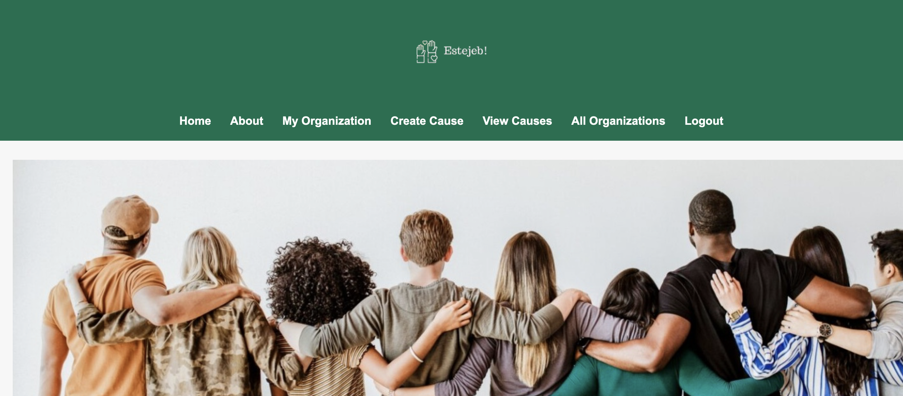

# 👐 Estejeb! — Volunteer Matching Platform

### Connect. Contribute. Create Change.

---

## 🌐 Platform Preview

---

## 📖 Overview

**Estejeb!** is a web-based platform designed to empower **organizations** by streamlining how they **post, manage, and promote volunteer opportunities**. Built with simplicity and scalability in mind, Estejeb! focuses on connecting causes with the right volunteers — starting with core features for organizations, with exciting stretch goals for volunteers planned in future releases.

Whether you're a nonprofit, school, or company looking to make an impact, Estejeb! helps you mobilize support and share your mission with the world.

---

## ⚙️ Core Features (MVP)

### 👥 Organization Management

- Sign up and log in as an organization  
- Create and edit your organization's profile  
- Post, edit, and delete volunteer opportunities  

### 📢 Volunteer Opportunity Listings

- Create detailed listings with:
  - Title, description, location
  - Number of volunteers needed
  - Age and certification requirements
- Public opportunity listings viewable by guests

### 🌐 Guest Access

- Browse all active volunteer opportunities
- View detailed listings without login

---

## 🧩 Stretch Goals (Planned Features)

### 🧑‍🤝‍🧑 Volunteer Profiles & Applications *(Not Yet Implemented)*

- Volunteers will be able to sign up, create a profile, and apply to opportunities  

---

## 🎮 How It Works

1. **Organizations Register** → Build a profile and post opportunities  
2. **Guests Browse Listings** → View details and find causes to support  
3. *(Planned)* **Volunteers Apply** → Submit applications to causes they care about  

---

## 🚀 Getting Started

### Deployed Platform

🔗 https://estejeb-f347c0f41166.herokuapp.com/

### Project Planning

- 📋 Trello Board: *Link Coming Soon*  
- 🛠️ Capstone Document: *Available upon request*

---

## 🛠 Technologies Used

- Django (Back-End)  
- PostgreSQL (Database)  
- HTML/CSS/JavaScript (Front-End)  
- Git/GitHub (Version Control)  

---

## 🔮 Next Steps

### Planned Enhancements

- Volunteer-side login and profile management  
- Application system with status tracking  
- Opportunity filtering by skills and interest  
- Organization dashboards for managing applicants  

---

## ❤️ Conclusion

Whether you’re building community, raising awareness, or organizing impact, **Estejeb!** makes it easy to connect causes with the people who care. Let’s make volunteering simple, accessible, and meaningful — one opportunity at a time.

**Ready to make a difference?**
*Estejeb! — Because every helping hand counts.*
